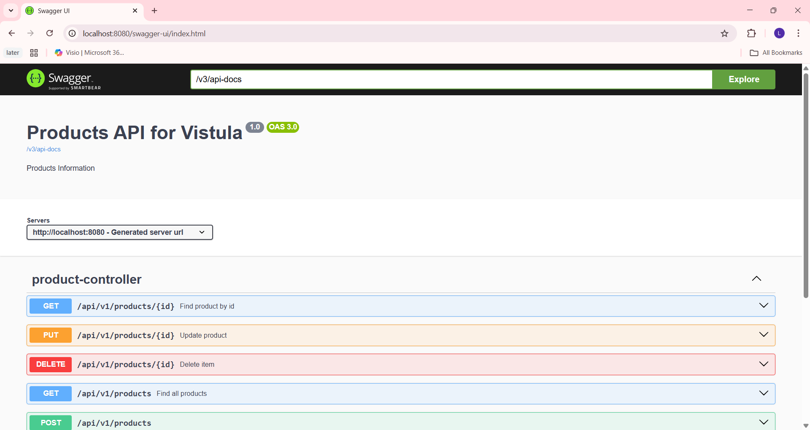
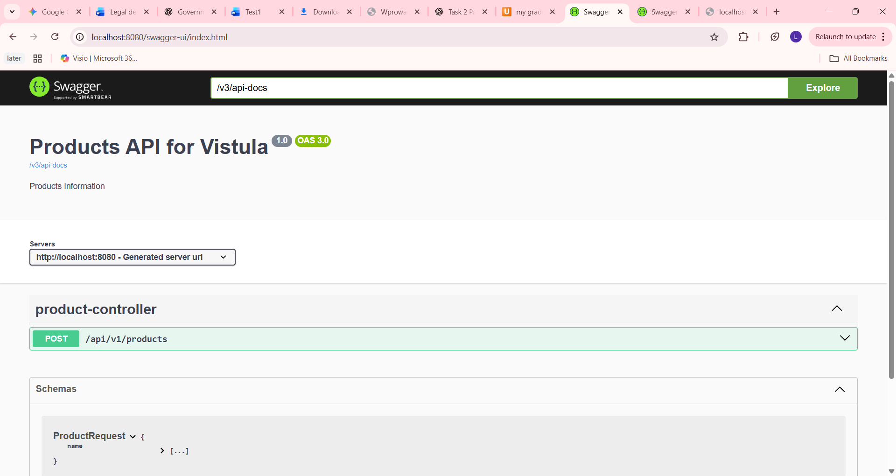
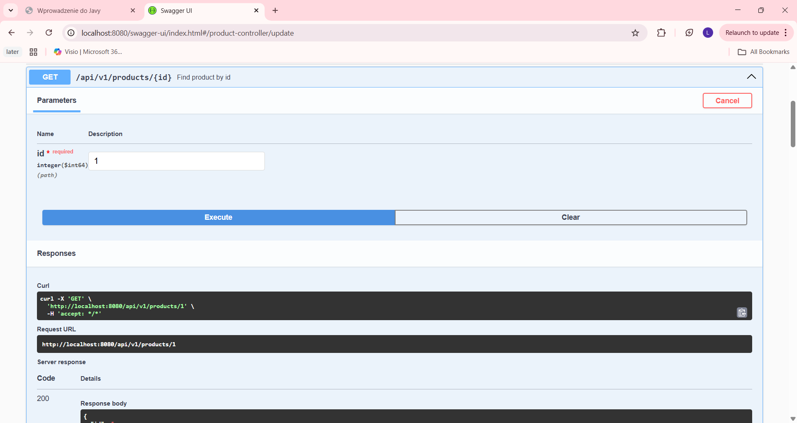
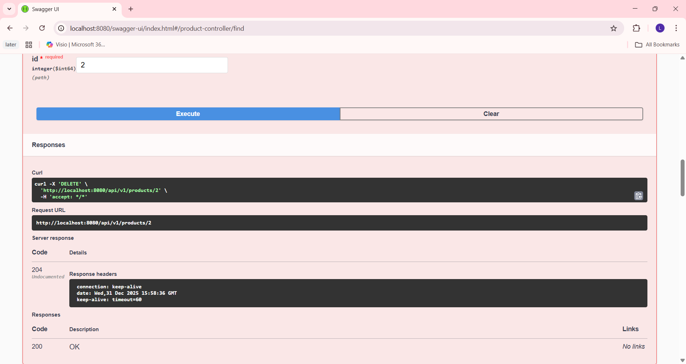
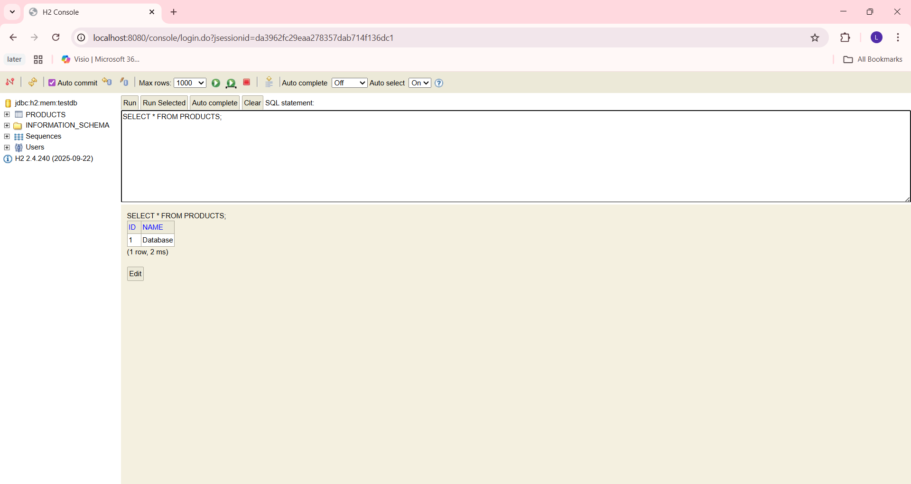
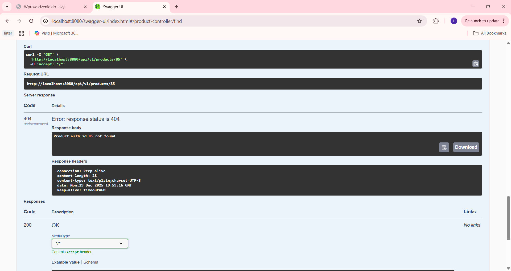

**Task 2 – Spring Boot REST API**

**Project Overview**

This project is Task 2 of the Spring Framework assignment.
It is a REST API backend application that supports full CRUD operations for managing products.

**Technologies Used**:

* Java
* Spring Boot
* Spring Web
* Spring Data JPA
* H2 Database
* Swagger / OpenAPI
* Maven


**Application Startup**

Spring Boot application running successfully:

API Documentation (Swagger)

Swagger UI is used to document and test the REST API.

Swagger UI:

http://localhost:8080/swagger-ui/index.html

Swagger UI showing available endpoints: 


**REST API Endpoints**
:Create Product (POST)

Endpoint:

POST /api/v1/products

Example Request Body:

{
"name": "Vistula Laptop"
}

Result: Product is created with status 201 Created

Screenshot – Create Product: 


**Get Product by ID (GET)**

Endpoint:

GET /api/v1/products/{id}

Result: Returns product with status 200 OK

Screenshot – Get Product by ID: 


**Get All Products (GET)**

Endpoint:

GET /api/v1/products

Result: Returns list of all products

Screenshot – Get All Products: 


**Update Product (PUT)**

Endpoint:

PUT /api/v1/products/{id}

Example Request Body:

{
"name": "Update Application Name"
}

Result: Product is updated successfully

Screenshot – Update Product: 


**Delete Product (DELETE)**

Endpoint:

DELETE /api/v1/products/{id}

Result: Product is deleted with status 204 No Content

Screenshot – Delete Product: 


**Summary of Endpoints**

| Method | Endpoint | Description |
| :--- | :--- | :--- |
| `POST` | `/api/v1/products` | Create a new product |
| `GET` | `/api/v1/products/{id}` | Get product by ID |
| `GET` | `/api/v1/products` | Get all products |
| `PUT` | `/api/v1/products/{id}` | Update a product |
| `DELETE` | `/api/v1/products/{id}` | Delete a product |

---


**Database (H2)**

The application uses an H2 in-memory database.

H2 Console:
http://localhost:8080/console

JDBC URL:

jdbc:h2:mem:testdb

H2 Console Login Screen:


Product Table with Data: 


**Exception Handling**

The application includes custom exception handling for cases where a product is not found.

Example:

GET /api/v1/products/999

Result: Returns 404 Not Found with error message

Screenshot – Product Not Found: 


The project follows a layered architecture:

**Project Structure**

## Project Structure
```text
First_Rest_Api_Spring
├── src
│ ├── main
│ │ ├── java
│ │ │ └── pl
│ │ │ └── edu
│ │ │ └── vistula
│ │ │ └── first_rest_api_spring
│ │ │ ├── FirstRestApiSpringApplication
│ │ │ │
│ │ │ └── product
│ │ │ ├── api
│ │ │ │ ├── request
│ │ │ │ ├── response
│ │ │ │ ├── ProductController
│ │ │ │ └── ProductExceptionHandler
│ │ │ │
│ │ │ ├── domain
│ │ │ │ └── Product
│ │ │ │
│ │ │ ├── repository
│ │ │ │ └── ProductRepository
│ │ │ │
│ │ │ ├── service
│ │ │ │ └── ProductService
│ │ │ │
│ │ │ └── support
│ │ │ ├── Exception
│ │ │ ├── ProductExceptionSupplier
│ │ │ └── ProductMapper
│ │ │
│ │ └── resources
│ │
│ └── test
│
├── screenshots
├── .gitignore
├── HELP.md
├── mvnw
├── mvnw.cmd
├── pom.xml
└── README.md
```

Controller – handles HTTP requests

Service – business logic

Repository – database access

Domain – entity classes

Support – mappers and exception handling

**TASK2G ANSWER**

By extending JpaRepository<Product, Long>, my ProductRepository interface inherits a robust set of standard CRUD methods, such as save(), findById(), and deleteById(). This is made possible through the parameters defined in the Generics, where <Product, Long> explicitly informs Spring Data JPA to manage the Product entity and recognize its primary key as a Long type. 

At runtime, Spring scans for the @Repository annotation and utilizes dynamic proxying to automatically create a concrete implementation class. This proxy class handles the underlying complexity of SQL generation and direct communication with my H2 database, ensuring the application remains functional even though my developer-written interface remains empty
